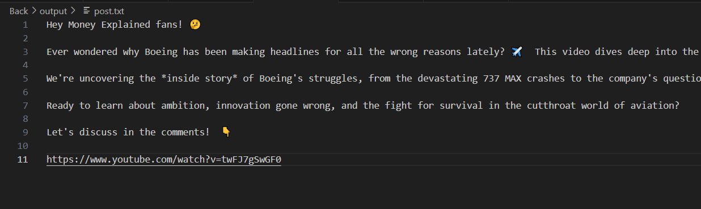

# Youtube Post Creator

## Overview
This is a project that uses llm and crew ai models to create a post that is supposed to promote a given video on YouTube. 
In order for the post to generate a given post, you need to place a link to a given video on YouTube with the transcript enabled, the bot will analyze it using agents and spit out the result.

## Technologies Used
- **CrewAI**: Python library that creates AI agents that perform specific tasks.
  

### Image

Result:

